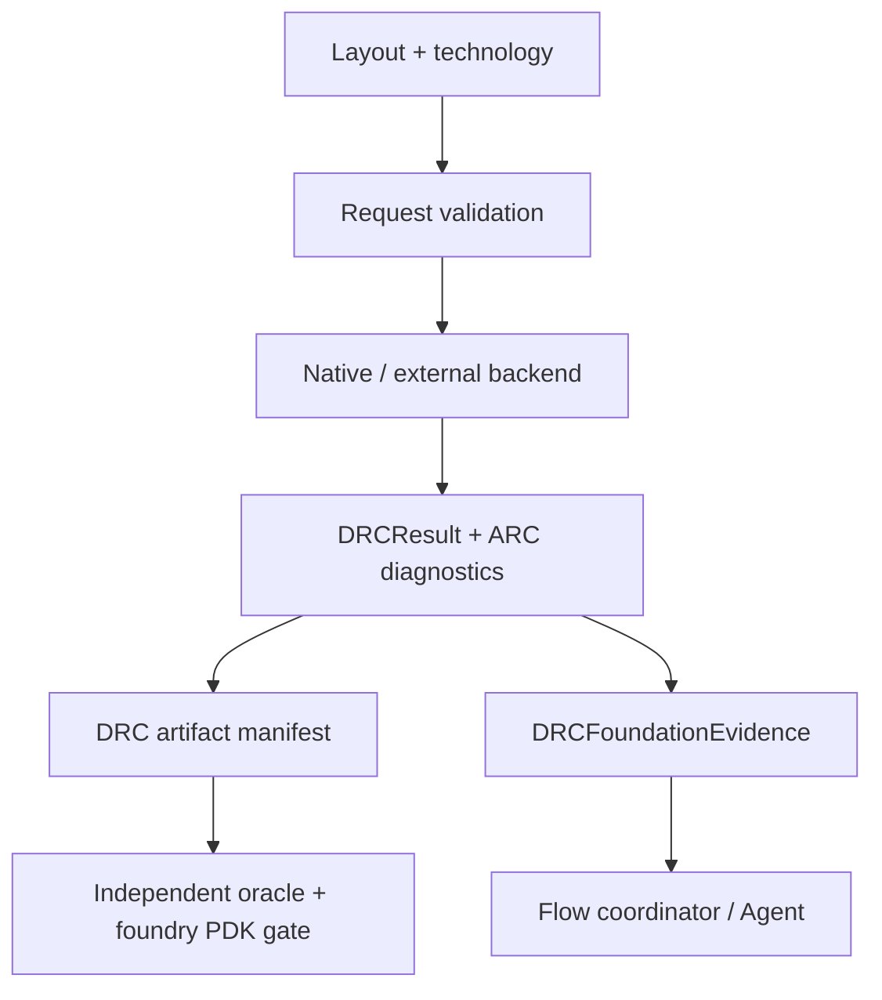

# DRCEngine Design Contract

## Responsibility

DRCEngine evaluates layout design rules and antenna rules. It may use the
native Swift kernel or an independently identified external tool. It records
the evidence needed to decide whether a run is merely executable, qualified,
or eligible for signoff.

## Foundation integration

`DRCEngineProtocol` refines `CircuiteFoundation.Engine` with
`DRCRequest`/`DRCExecutionResult`. `DefaultDRCEngine.execute` is the canonical
protocol entry point; `run` remains available for DRC cancellation and
timeout-specific controls.

`DRCFoundationEvidence` implements `EvidenceProviding` and
`DiagnosticReporting`. The caller supplies the verified `ArtifactReference`
values and `ExecutionProvenance`; the package never invents a digest or
pretends that a report URL is an artifact proof.

`DRCRequest.designObjectReference()` maps the top cell to a Foundation cell
identity while preserving DRC's existing request model.

## Responsibility boundary

| Concern | Owner |
|---|---|
| DRC geometry, ARC, waivers, native backends | DRCEngine |
| Foundry-deck import and qualification | DRCEngine + PDK evidence gate |
| Stable engine/evidence vocabulary | CircuiteFoundation |
| Project/run lifecycle and human approval | Xcircuite / DesignFlowKernel |

An ARC kernel is not equivalent to foundry-rule validation. An empty or
unqualified antenna rule set must remain a blocked result.
