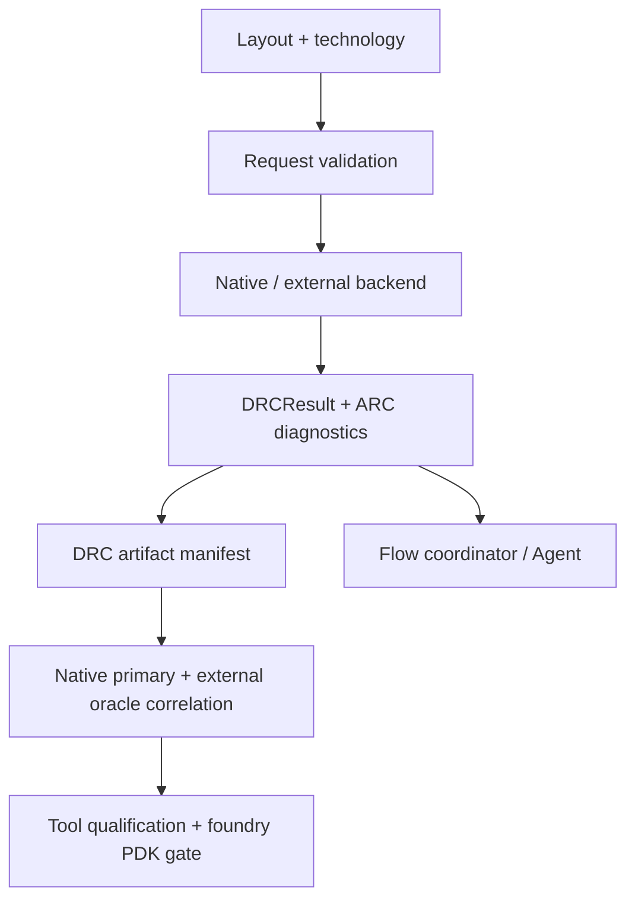

# DRCEngine Design Contract

## Responsibility

DRCEngine evaluates layout design rules and antenna rules. It may use the
native Swift kernel or an independently identified external tool. It records
raw observations, correlation results, and domain assessments. ToolQualification
and the composing flow policy decide tool trust and signoff eligibility.

## Foundation integration

`DRCExecuting` refines `CircuiteFoundation.Engine` with
`DRCRequest`/`DRCExecutionResult`. `DefaultDRCEngine.execute` is the canonical
protocol entry point; `run` remains available for DRC cancellation and
timeout-specific controls.

DRC retains its typed artifact manifest and diagnostics directly. A report URL
is not promoted to `ArtifactReference` without digest and byte-count
attestation, and no Foundation projection type manufactures missing evidence.

`DRCRequest.designObjectReference()` maps the top cell to a Foundation cell
identity while preserving DRC's existing request model.

## Responsibility boundary

| Concern | Owner |
|---|---|
| DRC geometry, ARC, waivers, native backends | DRCEngine |
| Foundry-deck import and domain assessment | DRCEngine |
| Tool/process qualification | ToolQualification + PDK evidence gate + flow policy |
| Stable engine/evidence vocabulary | CircuiteFoundation |
| Project/run lifecycle and human approval | Xcircuite / DesignFlowKernel |

An ARC kernel is not equivalent to foundry-rule validation. An empty antenna
rule set, or one without an external qualification record, must remain blocked.
