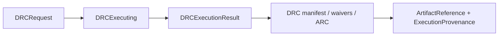
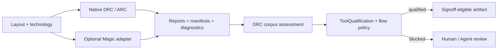

# DRCEngine

## CircuiteFoundation boundary

DRCEngine is an independent signoff engine. It owns DRC and antenna-rule
evaluation, while `CircuiteFoundation` owns only the cross-engine vocabulary:
`Engine`, `DesignObjectReference`, `ArtifactReference`, `EvidenceManifest`,
`ExecutionProvenance`, and typed diagnostics.



`DefaultDRCEngine` conforms directly to `DRCExecuting`; no projection,
adapter, or result envelope sits between the domain engine and the shared
`Engine` contract. DRCEngine produces independent-oracle correlation and PDK
observations; `ToolQualification` and the composing flow policy decide whether
that evidence qualifies a tool and process scope.

Every `DRCExecutionResult` carries mandatory `ExecutionProvenance`. The
provenance binds the exact digest-and-byte-count input references, the native
entry point or external process invocation, a sanitized environment
fingerprint, and the implementation producer. `ProducerIdentity.build` is the
measured SHA-256 of the executable carrying the implementation; Magic also
requires an explicit tool version (`MagicDRCToolchain.toolVersion`, or
`MAGIC_VERSION` for automatic discovery). Persisted artifact manifest
schema 2 repeats that producer identity, so a report or summary cannot be
attributed to the flow wrapper instead of the backend that produced it.

Protocol-composed design-rule checking for local, scriptable semiconductor
layout flows. DRCEngine provides native Swift DRC, standard mask-data checking,
Magic batch integration, foundry-deck import, structured diagnostics, retained
artifacts, and Agent-facing assessment records.

> **Qualification status:** the DRC/ARC kernels, import pipeline, regression
> corpus, and evidence contracts are implemented and tested. Production
> signoff is **not claimed** until a pinned foundry PDK/deck has been compared
> with an independently identified oracle and the resulting evidence has been
> retained. An empty or incomplete antenna deck fails the release gate; it is
> never reported as a clean antenna result.

## Xcircuite integration

[`Xcircuite`](https://github.com/1amageek/Xcircuite) is the umbrella runtime
that invokes DRCEngine through a flow stage executor and indexes DRC reports,
diagnostics, evidence, and artifact manifests in the shared run ledger.
DRCEngine remains independently usable and owns DRC/ARC semantics, raw
observations, domain assessments, and signoff diagnostics.

## Scope at a glance

| Capability | Current contract |
|---|---|
| Native DRC | In-process Swift backend for canonical layout JSON and standard mask inputs |
| ARC | PAR/CAR, surface/sidewall, process-stage, diffusion, via/contact connectivity, and structured repair diagnostics |
| Foundry import | Magic tech/deck parsing into typed technology and native antenna artifacts |
| External reference | Optional headless Magic adapter; external identity and file digests are retained |
| Agent / CI | CLI, typed APIs, corpus runs, resumable checkpoints, artifact manifests, signatures, and assessment criteria |
| Production signoff | Blocked until ToolQualification accepts independent-oracle evidence and a pinned PDK qualification record is present |



## Requirements and workspace layout

- macOS 26 or later
- Swift 6.3 or later
- SwiftPM
- Optional: Magic and an installed PDK for external reference runs

`Package.swift` resolves dependencies in two modes. Inside the LSI workspace it
uses sibling checkouts so local engine changes can be tested together. Outside
that workspace it falls back to pinned GitHub revisions for public dependencies.
For cross-engine development, keep the checkout in this shape:

```text
LSI/
├── DRCEngine/
├── SignoffToolSupport/
├── semiconductor-layout/
└── swift-mask-data/     # required transitively by semiconductor-layout
```

[`CircuiteFoundation`](https://github.com/1amageek/CircuiteFoundation),
[`SignoffToolSupport`](https://github.com/1amageek/SignoffToolSupport),
[`semiconductor-layout`](https://github.com/1amageek/semiconductor-layout), and
[`swift-mask-data`](https://github.com/1amageek/swift-mask-data) are public repositories. A fresh
single-package clone can therefore build through the pinned remote dependencies,
while the LSI workspace keeps local path dependencies for coordinated
development.

## Modules

| Module | Responsibility |
|---|---|
| `DRCCore` | `DRCRequest` / `DRCResult` / structured diagnostic models, `DRCBackend` protocol, typed errors |
| `DRCNative` | `NativeDRCBackend` (`native`) and `LayoutGDSDRCBackend` (`native-gds`) |
| `DRCParsers` | Magic report parsing into typed violations |
| `DRCAdapters` | Magic batch invocation (`drc.tcl`), tool-gated |
| `DRCPersistence` | DRC artifact persistence and compact run summary building |
| `DRCRuntime` | Backend registry and engine composition (`DefaultDRCEngine`) |
| `DRCEngine` | Umbrella module |
| `DRCCLICore` / `drcengine` | Testable CLI core + executable |

## Backend IDs

`DRCNative`, `native`, and `native-gds` are the only current Swift and CLI
surfaces for the in-process DRC path. Removed implementation-language backend
IDs are rejected with a typed backend-selection error.

The native GDS path invokes `LayoutDRCService` in `exactOnly` geometry mode.
Paths and non-rectilinear polygons therefore produce a blocking
`drc.unsupported_exact_geometry` diagnostic until the exact edge kernel is
covered by retained correlation evidence accepted through ToolQualification.
Interactive layout feedback may still use the explicit
`development` mode; that result must not be promoted to signoff evidence.

Every `DRCRequest` validates its top-cell, selected backend, timeout, and POSIX
environment before lookup. In-process backends cooperatively observe the same
timeout and cancellation contract; external Magic runs use the process-tree
timeout. Native JSON input rejects invalid geometry, duplicate IDs, and
non-finite rule data before evaluation. When a working directory is supplied,
the engine verifies the persisted manifest against the actual files, path
containment, byte counts, and SHA-256 digests before returning the result.
Downstream consumers can repeat this gate with `DRCArtifactManifestVerifier`.

For a release or Agent trust boundary, artifact manifests can also be signed
with Ed25519. Inject `DRCEd25519ArtifactSigner` through
`DRCArtifactStore(signer:)`, set `DRCOptions.requireSignedArtifacts`, and pin
the signer's base64 public key in `DRCOptions.trustedArtifactPublicKey`. The
engine signs the canonical manifest payload with the signature field omitted,
then verifies the signed manifest before returning. Verification is therefore
bound to the persisted report, request/environment commitments, backend
identity, and artifact digests rather than to a log string.

The CLI exposes the same boundary with
`--require-signed-artifacts`, `--trusted-artifact-public-key`, and
`--artifact-signing-private-key`. The private-key option accepts a raw 32-byte
Ed25519 key file or a base64-encoded 32-byte key file. Keep private keys outside
the project and do not commit them.

For a production-oriented standard-layout run, add `--require-antenna-rules`.
The native-gds backend then fails closed when the technology JSON has no
`antennaRules`; an empty antenna rule set is never presented as zero antenna
violations. The same gate is available as `DRCOptions.requireAntennaRules` and
`DRCCorpusRunOptions.requireAntennaRules`.

## Capability snapshot

Agents should use `drcengine --capabilities --json` before selecting a backend or
claiming release readiness. The command emits `DRCCapabilitySnapshot`, a stable
JSON contract that lists the preferred backend, all current backends, whether a
backend needs an external tool, supported input formats, produced artifacts,
diagnostic coverage, corpus coverage tags, Agent-facing contracts, and open
milestones.

```bash
drcengine --capabilities --json
```

The snapshot is intentionally separate from `--action-domain`: `--action-domain`
describes executable planning operations, while `--capabilities` describes the
trust surface and remaining capability gaps for standalone DRC.

## Developer CLI Check

For local development, validate the executable boundary before changing DRC
schemas, corpus contracts, or backend behavior:

```bash
../scripts/check-developer-cli.sh
```

The check builds `drcengine`, runs the committed DRC corpus through the real
executable, verifies the generated `drc-corpus-report.json`, asserts that the
legacy self-oracle corpus is not signoff-qualified, checks pass rate and key
coverage tags, then confirms that unknown CLI arguments fail instead of being
ignored. A committed regression corpus is not independent qualification evidence.

When debugging manually, use the SwiftPM-built executable:

```bash
DRC_BIN="$(swift build --show-bin-path)/drcengine"
"$DRC_BIN" \
  --corpus Tests/DRCCLICoreTests/Fixtures/DRCCorpus/drc-corpus.json \
  --out /tmp/drc-corpus-run \
  --json
```

## Agent evidence packet

`drcengine --evidence-packet-from-corpus-report` converts a retained
`drc-corpus-report.json` into `DRCEvidencePacket`, the richer Agent-facing
decision-material contract. This is separate from `--observations-from-corpus-report`,
which emits the compact, signed corpus observation record consumed by ToolQualification.

```bash
drcengine --evidence-packet-from-corpus-report /path/to/drc-corpus-report.json \
  --out /tmp/drc-evidence-packet.json \
  --packet-id drc-evidence-release \
  --json
```

The packet preserves readiness separately from signoff judgment. A failing corpus
can still export a packet when retained cases produced usable diagnostics; the
failure is represented through `diagnostics`, `confidence`, and `decisionHints`
so an Agent or human can decide whether to inspect rule IDs, oracle readiness,
coverage, runtime budget, repair candidates, or waiver policy.

## Foundry deck semantic inspection

`drcengine --foundry-deck-semantics --json` emits the shared
`signoff-foundry-deck-semantics` artifact for the DRC side of the Sky130 foundry
deck contract. The command uses `SignoffToolSupport.SignoffDeckSemanticInventory`
with the Magic DRC requirement only, so a missing Netgen LVS setup does not
block DRC deck inspection. Add `--pdk-root <path>` to point at an explicit PDK
root or direct `sky130A` root. Add `--require-passed` when CI or an Agent needs a
non-zero exit status for missing DRC deck readiness or missing DRC semantic
coverage.

```bash
drcengine --foundry-deck-semantics --pdk-root ~/.volare --require-passed --json
```

## Magic rule import seed

`MagicDRCLayoutTechImporter` and `drcengine --import-magic-rules` are the
process-independent entry points for importing a Magic DRC tech file into a
`LayoutTechDatabase` seed. The command accepts either explicit input paths or a
catalog selector. PDK-specific layer names, aliases, derived layers, deck paths,
and cut-stack connectivity remain data rather than Swift source.

```bash
drcengine --import-magic-rules \
  --magic-tech /path/to/pdk/libs.tech/magic/process.tech \
  --profile /path/to/magic-layouttech-profile.json \
  --tech-out /tmp/layout-tech.json \
  --report-out /tmp/rule-import.json \
  --json
```

Catalog-backed imports use the same generic command and resolve the Magic tech
deck plus profile reference from machine-readable data:

```bash
drcengine --import-magic-rules \
  --catalog /path/to/magic-rule-import-catalog.json \
  --catalog-id sky130-open-pdk \
  --pdk-id sky130A \
  --profile-id sky130.magic.layouttech \
  --pdk-root /path/to/pdk-root \
  --tech-out /tmp/layout-tech.json \
  --report-out /tmp/rule-import.json \
  --json
```

Catalog entries use required-file purposes such as `magic-drc-tech` and
`magic-layouttech-profile`. A bundled profile resource can be referenced through
the metadata key `magicLayoutTechProfileResource`. The CLI output records the
resolved catalog path, catalog ID, PDK ID, profile ID, source path, profile path,
and optional profile resource name.

Catalog readiness can be inspected before import. This is the Agent/CI preflight
surface for confirming that catalog JSON, required deck files, and bundled
profile resources are available without generating a technology seed:

```bash
drcengine --inspect-magic-rule-import-catalog \
  --catalog /path/to/magic-rule-import-catalog.json \
  --pdk-root /path/to/pdk-root \
  --out /tmp/magic-rule-import-catalog-inventory.json \
  --require-passed \
  --json
```

When no explicit catalog is supplied, `--pdk-root` performs bounded local
discovery of `magic-rule-import-catalog.json`. When explicit catalogs are
supplied, `--pdk-root` is also used as the resolution root for relative
`requiredFiles`. The JSON artifact kind is
`drc-magic-rule-import-catalog-inventory` and reports PDK-root, catalog, entry,
required-file, and bundled-profile-resource status without log scraping.
Catalog resolution also rejects duplicate entries, duplicate profile IDs,
duplicate required-file purposes, empty/control-character identifiers, and
empty/control-character paths before any deck is imported.

Bundled profile resources use the same generic entry point:

```bash
drcengine --import-magic-rules \
  --magic-tech /path/to/pdk/libs.tech/magic/process.tech \
  --profile-resource sky130-magic-layouttech-profile \
  --tech-out /tmp/layout-tech.json \
  --report-out /tmp/rule-import.json \
  --json
```

Use `--require-complete` when a release or Agent gate must fail until every
observed Magic rule family is represented by the native rule model. The generic
JSON output includes the input source path, resolved profile path, optional
profile resource name, optional catalog provenance, generated technology path,
optional report path, and the structured import report.

## Installed-PDK Magic rule import

`drcengine --import-foundry-magic-rules` resolves an installed PDK through the
signoff profile catalog and converts the supported Magic DRC deck into a
`LayoutTechDatabase` JSON seed for the `native-gds` backend. The explicit
`drcengine --import-magic-rules` route accepts a deck and a
`MagicDRCLayoutTechImportProfile` JSON artifact directly. PDK-specific layer
stack data remains in profile artifacts; Swift owns the Magic dialect parser,
profile validation, and typed IR lowering. The importer first runs the Magic DRC
semantic readiness gate, then parses Magic `layer` / `calma` mapping,
`types` / `aliases`
layer expressions, and DRC `width`, same-layer and cross-layer `spacing`,
`area`, `notch`, resolvable `surround`
enclosure, same-layer `widespacing`, resolvable `overhang` extension,
`rect_only` rectangular-geometry rules, `angles` layer-angle restrictions,
`exact_overlap` layer-pair rules, and Sky130 hole-empty `cifmaxwidth`
patterns as minimum enclosed-area rules. Source Magic `cut` declarations are
parsed as cut-class alias evidence, so real deck aliases such as `v1/m1` resolve
to the canonical cut layer and the import report records `sourceCutLayerNames`
and `sourceCutAliasCount`. Source Magic `contact` section connectivity is
parsed into `sourceContactStacks` / `sourceContactStackIDs` /
`sourceContactStackCount`, so deck-owned cut-layer bottom/top connectivity can
seed interconnect definitions without adding process-specific Swift constants.
Source Magic `wiring contact` geometry is also parsed into
`sourceContactDefinitionIDs` / `sourceContactDefinitionCount` and is preferred
for via/contact cut size and directional enclosure when available.
Source Magic `exact_overlap` declarations are recorded as
`sourceExactOverlapRules` / `sourceExactOverlapRuleCount` evidence in the
import report and as `LayoutExactOverlapRule` entries in the generated
`LayoutTechDatabase`, so the `native-gds` backend can emit structured
`exactOverlap` diagnostics from standard mask inputs. Parenthesized layer sets
with one-of secondary semantics, including Sky130 `(allcont)/a`, are preserved
as multi-secondary exact-overlap rules instead of being split into stricter
all-secondary requirements.
Resolvable cross-layer Magic `spacing` declarations become
`LayoutSpacingRule` entries in the generated `LayoutTechDatabase`, so the
same `native-gds` backend emits structured `minSpacing` diagnostics for
standard mask inputs without scraping Magic text.
Source Magic `_small_hole` / `_hole_empty` temp-layer definitions feeding
`cifmaxwidth ... 0` are recorded as `sourceEnclosedHoleRules` /
`sourceEnclosedHoleRuleCount` evidence and become
`LayoutLayerRuleSet.minEnclosedArea`, so `native-gds` can emit structured
`minEnclosedArea` diagnostics from standard mask inputs.
Other Magic `cifmaxwidth ... 0` marker layers are recorded as
`sourceForbiddenMarkerRules` / `sourceForbiddenMarkerRuleCount` evidence and as
`LayoutForbiddenLayerRule` entries in the generated technology seed. If marker
geometry is present in standard layout input, `native-gds` emits structured
`forbiddenLayer` diagnostics. Source Magic `templayer` definitions are also
recorded as `sourceTempLayerDefinitions`,
`sourceTempLayerDefinitionCount`, and `sourceTempLayerOperationCounts`, so an
Agent can inspect the marker dependency graph without scraping the Magic deck.
Source temp layers using `and`, `or`, `and-not`, `xor`, `grow`, `grow-min`, `shrink`,
`bridge`, `close`, `bloat-all`, Magic `boundary`, and geometry-neutral `mask-hints` aliases are
compiled into dependency-ordered `LayoutDerivedLayerRule` records for marker
materialization, and the import report records
`sourceTempLayerMaterializedRuleIDs` plus
`sourceTempLayerMaterializedRuleCount`. The `bloat-all` operation preserves the
Magic seed/guide layer split through `primarySourceLayerCount` instead of
treating it as an unbounded grow. Magic `boundary` maps to the generic
`cell-boundary` operation, which reads canonical cell properties such as
`FIXED_BBOX` / `lsi.fixedBBox` from native layout JSON and materializes the
cell abutment box as derived marker geometry. Magic `bridge` materializes
rectangle bridge fill for diagonal gap and corner-pinch cases, and Magic
`close` materializes enclosed empty rectangles below the configured area
threshold before downstream boolean marker operations run.
Magic MiM / pad layer expressions that depend on derived geometry are recorded
as `LayoutDerivedLayerRule` entries. The current Sky130 seed materializes
rectangular `MIMCC = VIA3 ∩ CAPM` and `MIM2CC = VIA4 ∩ CAPM2` intersections
before native-gds DRC, so MiM contact width/spacing/enclosure/exact-overlap
rules run from standard mask inputs without assigning conflicting GDS layer
maps.
When a cut layer has source contact-stack connectivity plus source contact
geometry, or imported cut size plus both adjacent conductor enclosure rules, the
importer derives a canonical `LayoutViaDefinition` or
`LayoutContactDefinition`, derives a matching `LayoutMinimumCutRule` seed, and
records those IDs in the import report. The
default cut count remains `1`, but a profile can declare explicit
`minimumCutCount` on a cut-stack connection. Those policies are emitted as
`profileMinimumCutPolicies` / `profileMinimumCutPolicyIDs` /
`profileMinimumCutPolicyCount` in the import report and drive the generated
`LayoutMinimumCutRule.minimumCount` without putting process-specific values in
Swift source. Generic Magic-deck `minimumcut` / `cutcount` source policy lines
are emitted as `sourceMinimumCutPolicies` / `sourceMinimumCutPolicyIDs` /
`sourceMinimumCutPolicyCount`, recorded in `importedFamilyCounts.minimum_cut`,
and override profile defaults when producing `LayoutMinimumCutRule.minimumCount`.
The parser accepts explicit cut/bottom/top/count forms, repeated explicit
cut/bottom/top/count groups on one source line, count-before-conductor forms,
and cut/count forms when the profile or source contact stack identifies one
unique conductor stack for that cut layer. Ambiguous stack inference and extra
unmatched counts remain skipped-rule diagnostics instead of guessed native
rules.
Imported `angles` rules become `allowedAngleStepDegrees`
entries in the generated technology seed and drive structured `angle`
diagnostics in the `native-gds` path. Unsupported or unresolved Magic families
such as ambiguous multi-cut stack syntax, extra unmatched cut-count values, and
any future Magic `templayer` operation outside the typed materialization set
remain in the `drc-foundry-rule-import-report` diagnostics instead of being
silently dropped.
Magic `antenna` declarations are parsed into
`sourceAntennaRules` / `sourceAntennaRuleCount` evidence, including the
`partial`/`cumulative` model, `sidewall` versus `surface` measurement,
`ratioDiffB`/`ratioDiffA` correction semantics, and resolved process
thicknesses from `height` declarations. When a Magic deck also declares
derived aliases with different physical heights, canonical source-layer
declarations take precedence and only conflicting declarations of the same
source expression block lowering. `NativeDRCAntennaRuleFactory` can
lower this evidence into executable `NativeDRCRule` values when the caller
supplies gate-layer and cut-stack metadata; missing model or sidewall
thickness fails with a typed construction error. The importer itself still
reports the source family as `partial` and does not claim that a generic
`LayoutTech` area rule is equivalent to Magic's antenna kernel.
The canonical native JSON backend separately supports
`NativeDRCRule.Kind.maximumWidth`, `NativeDRCRule.Kind.forbiddenLayer`, and
`NativeDRCRule.Kind.exactOverlap`. `maximumWidth` reports excessive rectangle
span, `forbiddenLayer` reports marker geometry that must be empty, and
`exactOverlap` reports primary/secondary rectangle bounds that do not match
within the rule tolerance.

```bash
drcengine --import-foundry-magic-rules \
  --pdk-root ~/.volare \
  --profile /path/to/magic-layouttech-profile.json \
  --tech-out /tmp/sky130-layout-tech.json \
  --report-out /tmp/sky130-rule-import.json \
  --native-antenna-out /tmp/sky130-native-antenna-artifact.json \
  --json
```

To emit the lowered Native antenna artifact alongside the source report, add
`--native-antenna-out /path/native-antenna-artifact.json`. The output is a
`NativeDRCAntennaArtifact` envelope, not an unqualified rule array: it binds
the source/profile digests, profile layer order, source contact stacks,
thickness map, source declarations, native rules, and the domain assessment.
The artifact can be structurally validated, but its
`nativeAntennaAssessment` remains `blocked` until an independently
identified oracle has been run and recorded as agreeing.

The normal successful state for a fully represented deck is `complete`. Real
Sky130 PDK import may still report `partial` when observed families or ambiguous
cut-count rules are not represented by the native rule model. Import completion
is syntactic translation status only; it is not signoff qualification. Add
`--require-complete` when a release or Agent gate must fail until every observed
Magic rule family is represented by the native rule model.

## Standard-input backend: `native-gds`

`LayoutGDSDRCBackend` checks standard mask inputs (GDSII, OASIS, CIF, or DXF)
or canonical `native-json` layout input against a `LayoutTechDatabase` JSON rule
deck using the same `LayoutVerify` DRC kernel that drives the layout editor's
live verdicts — the standalone CLI and the editor cannot drift because they
share one kernel. Set `DRCRequest.technologyURL` to select it programmatically.
For standard mask inputs that do not carry canonical net IDs, minimum-cut rules
are still enforced when the imported cut-layer geometry proves an intentional
connection between overlapping conductor layers. Netless conductor crossings
without cut geometry are ignored by minimum-cut checks so standard inputs do not
produce false cut-count violations for unrelated crossings.

```bash
# Native on standard inputs (mask data + tech deck)
drcengine --layout design.gds --tech technology.json

# Native on canonical layout JSON when cell-level metadata is required
drcengine --layout design.layout.json --format native-json --tech technology.json

# Explicit backend override; default without --tech is magic
drcengine --layout design.gds --backend native-gds --tech technology.json
```

## Agent-facing diagnostics

Native diagnostics are structured for direct API and CLI consumers. Minimum-width,
maximum-width, manufacturing-grid, area, antenna ratio, density, notch, enclosed-area, spacing
including net-scoped, directional, parallel-run-length, and wide-metal threshold
spacing, enclosure, extension, angle, forbidden-layer, forbidden-overlap, and different-net overlap short errors populate
`ruleID`, `kind`, `layer`, `measured`, `required`, `unit`, `region`,
`relatedShapeIDs`, `relatedNetIDs`, and `suggestedFix`, so an Agent can identify
the offending shapes and propose a targeted edit without scraping a text log.
Every `maximumAntennaRatio` rule declares `antennaModel` and `antennaLayers`.
The ordered layer records define partial or cumulative process exposure and
carry each layer's measurement and ratio gate; scalar-only antenna rules are
rejected before evaluation. The rule's `value` mirrors its stage layer's
`ratioGate` and mismatches are rejected. A rule may also declare `processStep`;
when present, only conductor rectangles tagged with the same
`antennaProcessStep` participate in the ratio. This lets the native path
model process-step antenna checks without mixing later routing metal into an
earlier fabrication step. A rule may also declare `antennaCutConnections`, which
describe cut-layer links between adjacent conductor layers. When cut connections
are present, the antenna ratio only counts conductor layers reachable from the
gate layer through same-net cut rectangles that geometrically overlap both their
lower and upper layer shapes, so a global `netID` does not over-connect metal
that is not fabricated into the gate-connected stack yet. In a partial antenna
stage whose measured layer is itself a cut/contact, lower-layer connectivity is
sufficient, matching Magic's contact-stage exposure check. Multi-layer antenna
area is summed per conductor layer after same-layer union, so overlapping metal
on different layers is still counted as separate process exposure.
The native evaluator supports per-layer surface union area,
sidewall union perimeter multiplied by process thickness, partial versus
cumulative process exposure, and finite or `none` diffusion correction. A
`requireAntennaRules` request option is enforced by both native backends, so an
empty antenna deck cannot be reported as a clean, production-ready result.
For canonical Native JSON, a release-gated run must also provide
`antennaMetadata` with complete gate-area, diffusion-area, process-step, and
cut-connectivity attestations. The readiness gate also rejects every
net-bearing conductor covered by an antenna rule when that net has no positive
gate-area annotation; omitted annotations remain allowed only for non-release
exploratory runs.
`NativeDRCAntennaAssessment` records raw implementation evidence: source
import status, source/native rule counts, materialization gaps, and a
`NativeDRCAntennaOracleEvidence` record. That evidence binds the independent
oracle ID/version, executable/rule/technology digests, source/profile/native
rule digests, corpus/comparison artifact digests, and agreement counts.
Synthetic regression success alone therefore remains `blocked` until this
evidence is supplied. ToolQualification and the composing flow policy own the
release decision; DRCEngine does not promote its own observation to trusted
tool status.

When an independent Oracle run becomes available, the assessment is reproducible
from the two retained artifacts:

```bash
drcengine --assess-native-antenna \
  --native-antenna-artifact /path/native-antenna-artifact.json \
  --oracle-evidence /path/magic-antenna-oracle-evidence.json \
  --out /path/native-antenna-assessed.json \
  --json
```

`drcengine --json` emits the full diagnostics array, `runSummary`, and the report
/ manifest paths. The persisted report contains the same structured result.
`DRCRunSummaryBuilder` is the library-level contract for compact review summaries:

```swift
let runSummary = DRCRunSummaryBuilder().build(result: executionResult)
```

The summary keeps the full report as the source of truth while exposing the
pass/fail status, active/waived violation counts, unused waivers, and grouped
rule/layer/kind violation buckets for Agent / CI / Human review.

Saved reports can be summarized again without rerunning DRC. This is the
developer and Agent entry point for inspecting retained `drc-report.json`
artifacts from a run directory:

```bash
drcengine --summarize-report drc-report.json --json
```

Saved reports can also be converted into typed repair hints without scraping
logs:

```bash
drcengine --repair-hints-from-report drc-report.json --json
```

`DRCRepairHintBuilder` maps active, unwaived diagnostics into candidate layout
operations such as `layout.resize-shape`, `layout.translate-shape`,
`layout.add-rect`, `layout.delete-shape`, `layout.split-shape`, and
`layout.add-via`. Each hint preserves the source diagnostic index, rule/layer,
related shape/net IDs, measured/required values, region, operation parameters,
confidence, rationale, and verification gates. The hint artifact is advisory:
the design mutation still belongs to layout-command execution and must pass DRC
again, with LVS added for higher-risk topology-changing operations.

For minimum-cut violations, `layout.add-via` hints include a candidate
`positionX` / `positionY`, inferred `viaDefinitionID`, `cutLayer`,
existing/required/missing cut counts, and typed `relatedViaIDs` for existing cut
references. This keeps the repair artifact executable by downstream planning
without asking an Agent to reconstruct via placement from a text diagnostic.

For minimum enclosed-area violations, `layout.add-rect` hints use the diagnostic
region as an executable fill rectangle and include `fillPurpose`,
`enclosedArea`, and `requiredEnclosedArea` parameters. These hints require the
native LVS gate because adding geometry can change topology even when it clears
the local DRC violation.

For minimum-density violations, `layout.add-rect` hints derive a centered fill
rectangle from the diagnostic density window and include `fillPurpose`,
`densityWindowX`, `densityWindowY`, `densityWindowWidth`,
`densityWindowHeight`, `densityWindowArea`, `measuredDensity`,
`requiredDensity`, and `targetFillArea` parameters. These hints also require
the native LVS gate because density fill must remain connectivity-safe.

For minimum-spacing, different-net-overlap, and forbidden-overlap diagnostics,
`layout.translate-shape` hints include executable `deltaX` / `deltaY`
parameters when the saved result carries backend-provided repair geometry or can
read related shape geometry from a native JSON input. The in-process standard
layout backend now stores this repair geometry in `DRCExecutionResult`, so
GDSII/OASIS/CIF/DXF-derived diagnostics can produce executable translation
vectors without making downstream planning re-open the mask input. The hints also
preserve `anchorShapeID`, `translationAxis`, `translationReason`,
`translationDistance`, and overlap dimensions where available, so downstream
planning does not turn a translation candidate into a zero-distance move.

## Waivers

`DRCRequest.waiverURL` and `drcengine --waivers <waivers.json>` apply
diagnostic-level waivers before pass/fail is folded. A waived error keeps
`severity = error`, gains `waiverID` / `waiverReason`, increments
`diagnosticSummary.waivedErrorCount`, and no longer contributes to
`diagnosticSummary.errorCount` or `result.passed`.

The waiver file is saved as an input artifact with a digest. The report and
manifest both include `waiverReport`, including unused waiver IDs so stale policy
entries remain visible.

The waiver file records technical scope and rationale only. Human review and
approval are separate `DesignFlowKernel` records, allowing DRC output to remain
raw domain evidence while the flow policy evaluates who approved it and when.

## Corpus mode

`DRCCorpusRunner` and `drcengine --corpus <corpus.json> --out <dir> --json` run
multiple DRC cases and compare each result against expected pass/fail, active
error rule IDs, optional independent-reference agreement (`oracleBackendID`), and
optional duration budgets (`defaultMaxDurationSeconds` or per-case
`maxDurationSeconds`). When independent tools use different rule namespaces, a
case declares `expectedActiveErrorRuleIDs` for the primary backend and
`expectedOracleActiveErrorRuleIDs` for the oracle. The report keeps the raw IDs
from both tools, records direct ID equality separately, and accepts the
correlation only when both backend-specific assertions match. Cases may also
declare `coverageTags`, and a corpus
policy may require `requiredCoverageTags` so a release gate can fail when the
corpus passes but does not cover the required capability areas. A case may also
declare a `generatedLayoutFixture` so the corpus runner writes a deterministic
standard-layout input, such as a GDSII/OASIS/CIF/DXF file plus technology deck, before invoking
the backend. This keeps the `native-gds` lane under the same corpus assessment criteria
as JSON-layout rule semantics. Each case writes
its normal DRC report and artifact manifest under the corpus output directory. If
an oracle backend is specified, its report and manifest are written under the
case directory as separate artifacts.
The top-level `drc-corpus-report.json` includes per-case results, an aggregate
`summary`, and a durable `assessment` result for Agent / CI consumers. Each
run also records a `runID`, the canonical corpus-spec SHA-256, `completed`, and
an optional `parentRunID` when resumed. A checkpoint named
`drc-corpus-checkpoint.json` is written after every completed case. Only cases
whose previous result and artifact manifest still verify are reused on resume.
Use the API's `DRCCorpusRunEventHandler` or `DRCCorpusRunSession.events` for
case-level progress, checkpoint, completion, and cancellation events. The CLI
supports the same contract with `--run-id <id>` and
`--resume-report <drc-corpus-report-or-checkpoint.json>`.

Corpus
specs may declare `acceptanceCriteria`; when absent, the strict policy requires
every case, duration budget, and oracle agreement gate to pass. The summary
exposes pass rate, expectation-matched case count, duration-budget pass count,
primary/oracle execution failure counts, oracle agreement rate,
`nonIndependentOracleCaseCount`, `failureCategoryCounts`, and
`coverageTagCounts`. `DRCCorpusAssessment` records the acceptance criteria and
typed findings such
as `pass_rate_below_minimum`, `duration_budget_pass_rate_below_minimum`,
`required_coverage_missing`, `oracle_execution_failed`, or
`independent_oracle_failed`. Set `acceptanceCriteria.requireIndependentOracle`
for a release lane; same-backend, same-family, unknown-identity, and missing
provenance references then remain findings. `drcengine --corpus` uses
`assessment.meetsCriteria` for its execution exit status; this is corpus
acceptance evidence, not a tool-trust decision.
Saved reports can be rechecked without rerunning the corpus:

```bash
drcengine --assess-corpus-report drc-corpus-report.json --json
drcengine --assess-corpus-report drc-corpus-report.json \
  --acceptance-criteria acceptance-criteria.json --json
```

The same immutable report can also be exported as a signed raw observation for
ToolQualification or a flow consumer:

```bash
drcengine --observations-from-corpus-report drc-corpus-report.json \
  --evidence-id drc-release-corpus \
  --checked-at 2026-06-18T00:00:00Z \
  --json
```

The JSON includes the report artifact reference and digest plus an observation
record containing the criteria ID, observed metrics, observed counts and
finding codes. Successful export exits zero even when criteria findings remain;
the structured observation carries those findings to ToolQualification.

For a retained release artifact, sign and persist the evidence in one command:

```bash
drcengine --observations-from-corpus-report drc-corpus-report.json \
  --out drc-corpus-observations.json \
  --require-signed-artifacts \
  --trusted-artifact-public-key "$DRC_EVIDENCE_PUBLIC_KEY" \
  --artifact-signing-private-key /secure/path/drc-evidence.key \
  --json
```

`DRCCorpusObservationVerifier` re-reads the report, validates its derived
summary and assessment, compares the report digest, and verifies the
signature before the observation is consumed. Corpus runs support the same signed
artifact flags; resumed cases are reused only when their manifests satisfy
the active signature policy.

The optional policy file uses the same `DRCCorpusAcceptanceCriteria` JSON shape
as `acceptanceCriteria` in a corpus spec. This lets CI or an Agent apply a
stricter or looser release gate to retained corpus evidence without changing the
original run artifacts. Assessment and observation commands recompute derived
summary and finding fields from case results.

Persisted corpus reports are structurally validated before CLI assessment or
coverage audit (schema, case counts, result IDs, duration values, and duplicate
case IDs). Coverage audit intentionally recomputes its summary from case results
so a stale retained summary cannot silently alter the audit outcome.

A primary backend failure is recorded as `primary_execution_failed:*` on the case
result. A non-independent reference is rejected with
`same_backend_reference`, `same_implementation_family_reference`,
`reference_independence_unproven`, or `reference_attestation_unproven`; it is
never counted as agreement evidence. External identities include executable,
rule-program, and PDK/technology digests when available.
An external reference execution failure is recorded inside `oracleResult` as
`oracle_execution_failed:*` and also fails the case agreement gate, so missing
external tools leave a reviewable report instead of aborting the corpus run.

Corpus paths are resolved relative to the corpus spec file, which makes committed
fixtures portable across machines and CI runners.
`DRCCLICoreTests` packages both corpus directories through `Bundle.module`;
the retained GDS and Magic-layout inputs are owned by this package and do not
reach into a sibling checkout.

The committed Native and Magic golden corpora live under
`Tests/DRCCLICoreTests/Fixtures/DRCCorpus` and
`Tests/DRCCLICoreTests/Fixtures/MagicGolden`. They cover a clean layout, an active
standard-layout clean fixture for each GDSII/OASIS/CIF/DXF input format, active
standard-layout GDSII minimum-cut pass and fail fixtures,
manufacturing-grid failure, active minimum-width and maximum-width failures, an active minimum-area failure, active maximum-density and
minimum-density failures, an active multi-layer net-aware maximum-antenna-ratio failure, an active
process-step maximum-antenna-ratio failure, an active via-aware
maximum-antenna-ratio failure, an active minimum-cut failure, an active minimum-notch failure, an active
minimum-enclosed-area failure, active minimum-spacing failures for all-shape,
same-net, different-net, layer-pair, end-of-line, directional, and
parallel-run-length rule scopes, an active wide-metal spacing failure, an active cross-layer minimum-enclosure failure, an active
minimum-extension failure, an active forbidden marker-layer failure, an active
forbidden-overlap failure, an active exact-overlap failure, an active
different-net overlap short failure, and the width failure accepted only through
an explicit diagnostic waiver, each with a public CLI oracle result and required
coverage tags for clean, standard mask input, technology layer-map, manufacturing grid, minimum and maximum width, area, antenna, antenna multi-layer accumulation,
antenna process-step filtering, antenna cut-stack connectivity, maximum and
minimum cut, standard-input minimum cut, maximum and minimum density, notch, enclosed-area, spacing
net/layer/end-of-line/directional/parallel-run-length scope, enclosure,
extension, forbidden marker-layer, forbidden overlap, exact overlap, different-net overlap short, and
waiver behavior. The tight-budget fixture proves that a
correctness-clean run still fails the corpus gate when it exceeds its declared
benchmark budget. CLI tests additionally prove that a correctness-clean corpus
fails when `requiredCoverageTags` are missing. Runtime tests additionally inject
disagreeing backends to prove oracle mismatch fails the corpus gate. These
committed golden corpora intentionally omit oracle references and are regression
evidence only. They must remain unqualified under the independent-oracle policy.

The separate
`Tests/DRCCLICoreTests/Fixtures/ExternalOracle/drc-native-magic-correlation-corpus.json`
is the executable Native-versus-Magic lane. Every case uses `native-gds` as the
primary backend, `magic` as the oracle, and the same generated Sky130 GDS input.
It contains clean and violating width, spacing, and area pairs with explicit
backend-specific rule assertions. A correlation run therefore retains two real
executions, two independently identified implementation families, the shared
input digest, and the attested Magic executable, driver, and PDK digests. This
is raw correlation evidence; ToolQualification and flow policy still decide
whether that evidence is sufficient for a release scope.

## Result convention

`result.success` means the check **ran**. The typed `DRCVerdict` distinguishes
`passed`, `failed`, `unsupported`, `incomplete`, and `execution-failed`; only
`passed` is a clean design verdict. A missing summary or report is never
interpreted as clean.

Every engine result also retains the resolved `DRCBackendIdentity` in the result
and artifact manifest. This includes the implementation family and, when an
external executable and rule driver are readable, their SHA-256 digests. Corpus
provenance reuses these persisted identities instead of inferring trust from a
backend name alone.

Corpus specs default to `evidenceKind: "regression"`. A spec marked
`"independent-correlation"` additionally compares a stable marker fingerprint
set for each diagnostic. The fingerprint is derived from rule ID, diagnostic
kind, layer, normalized region, and related shape/via/pin/net IDs; message text
and execution order are intentionally excluded. A marker-set mismatch produces
`marker_set_mismatch` and blocks oracle agreement in that evidence lane. The
regression lane compares verdicts and rule assertions. It uses direct raw-ID
equality unless a case explicitly supplies `expectedOracleActiveErrorRuleIDs`.
The Native-versus-Magic fixture uses this explicit mapping because Magic's text
report does not expose the geometry required for marker-fingerprint equality.

## Build & test

```bash
swift build
swift test   # Magic-gated suites skip themselves when Magic is absent
```

For the full developer boundary check, run it from this package directory:

```bash
../scripts/check-developer-cli.sh
```

The committed regression corpora demonstrate Native and Magic backend behavior
and CLI reproducibility. They are deliberately not independent foundry
qualification; release claims require a distinct correlation corpus with
retained artifacts and digests for both independently identified backends.
